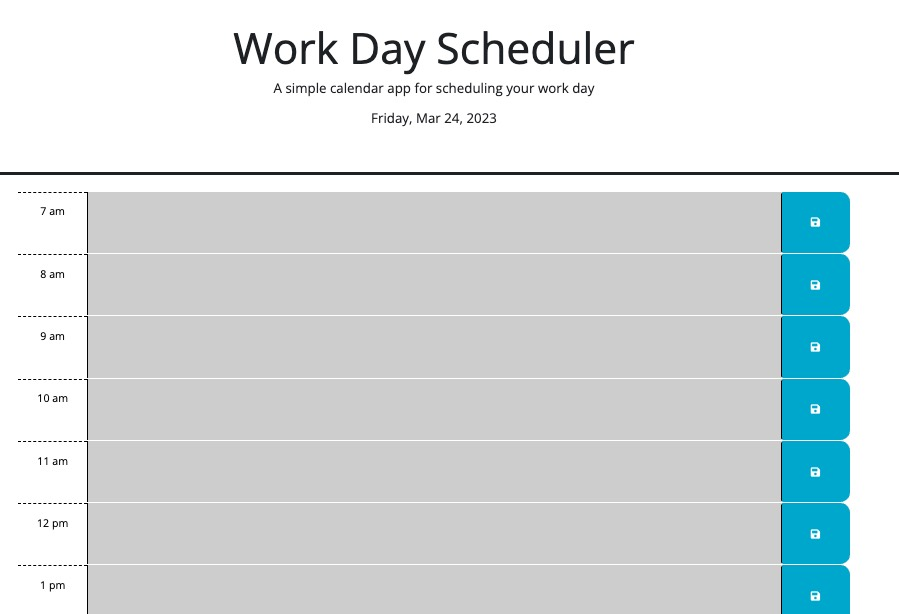
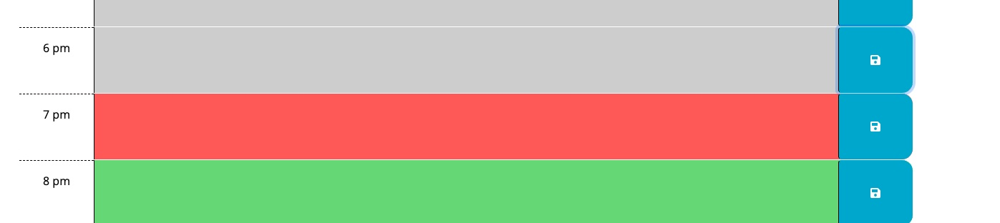
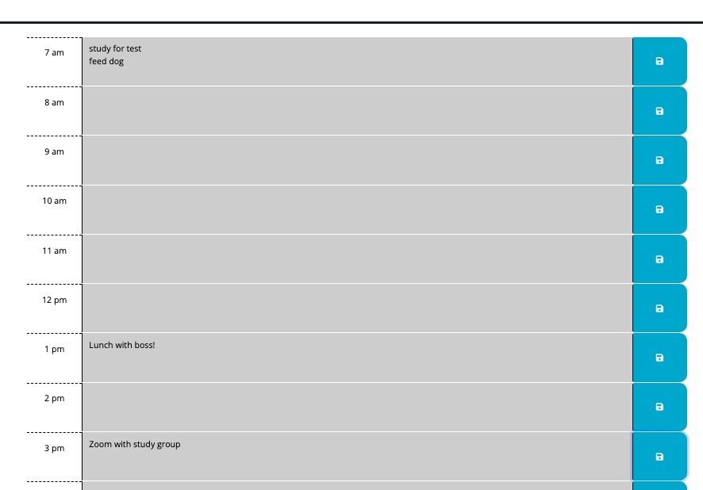

# Daily Scheduler

This application displays the hours of the workday and has input spaces for saving appointments or memos.

## Description

The application updates to the current day and hour using dayjs() app to display the hours and color them according to live time. If the hour is past the line is gray and if it's in the future the line will be green. THe current hour is dislpayed red. There are text areas on each hour line where you can fill in todo items or appointments and a save button that will save them in local storage. when the page refreshes the items that you saved will still be there.

## Installation

Navigate to the webpage: [https://phil-pfister.github.io/daily_schedule/](https://phil-pfister.github.io/daily_schedule/)

## Screen Shots

## Credits

I used the tools that I've learned in Rice university Boot Camp as well as research in MDN, Stack Overflow and Jquery API documentation online.  I recieved information on setting up the live bar during office hours. I also recieved help from David Elutilo during a tutoring session on March 24th 2023 on setting items to local storage.

[MDN](https://developer.mozilla.org/en-US/)

[Jquery](https://api.jquery.com/)

[Stack Overflow](https://stackoverflow.com/)

## Liscense

MIT
Copyright 2023 Phillip Pfister

Permission is hereby granted, free of charge, to any person obtaining a copy of this software and associated documentation files (the “Software”), to deal in the Software without restriction, including without limitation the rights to use, copy, modify, merge, publish, distribute, sublicense, and/or sell copies of the Software, and to permit persons to whom the Software is furnished to do so, subject to the following conditions:

The above copyright notice and this permission notice shall be included in all copies or substantial portions of the Software.

THE SOFTWARE IS PROVIDED “AS IS”, WITHOUT WARRANTY OF ANY KIND, EXPRESS OR IMPLIED, INCLUDING BUT NOT LIMITED TO THE WARRANTIES OF MERCHANTABILITY, FITNESS FOR A PARTICULAR PURPOSE AND NONINFRINGEMENT. IN NO EVENT SHALL THE AUTHORS OR COPYRIGHT HOLDERS BE LIABLE FOR ANY CLAIM, DAMAGES OR OTHER LIABILITY, WHETHER IN AN ACTION OF CONTRACT, TORT OR OTHERWISE, ARISING FROM, OUT OF OR IN CONNECTION WITH THE SOFTWARE OR THE USE OR OTHER DEALINGS IN THE SOFTWARE.
